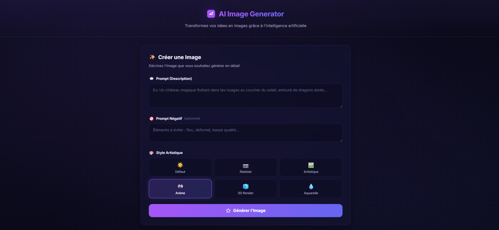
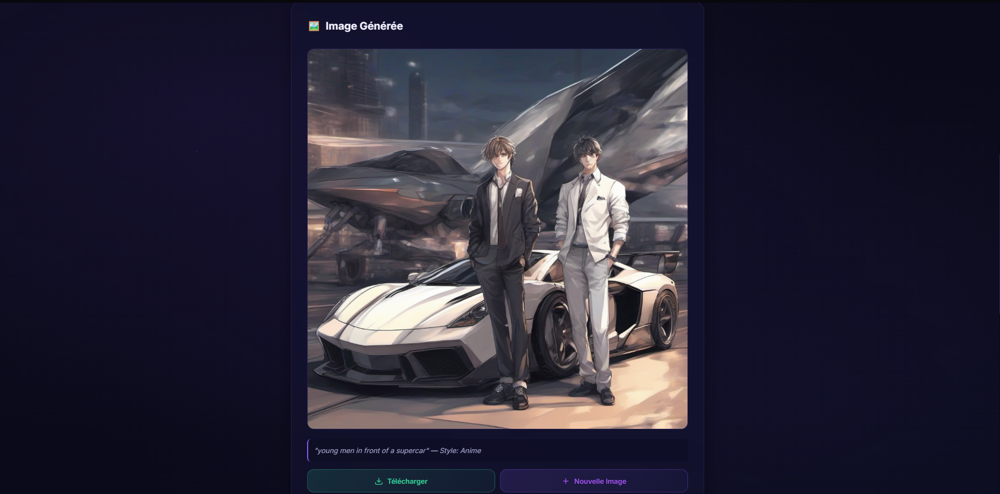
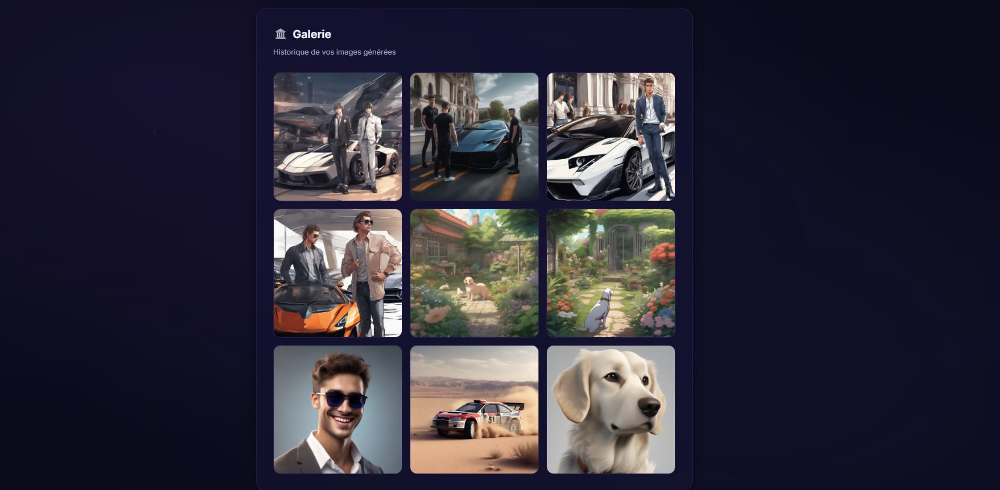

# 🎨 AI Image Generator — Génération d'Images par IA

Application web permettant de **générer des images à partir de descriptions textuelles** grâce à l'intelligence artificielle (Stable Diffusion XL).

##  📸 Captures d'Écran

### Image 1 - Interface Principale


### Image 2 - Exemple de Génération


### Image 3 - Galerie des Images Générées


##  🎬 Vidéo Démo

Démonstration complète de l'application (fichier trop volumineux pour être stocké localement) :

📽️ [Regarder la démo sur Google Drive](https://drive.google.com/file/d/1l7eh_Ge9l_cPW28XJF67bMmFJA-iMRcB/view?usp=sharing)

##  Architecture du Projet

```
Projet_IA/
├── server.py              # Serveur Flask (backend)
├── requirements.txt       # Dépendances Python
├── .gitignore
├── README.md
├── static/
│   ├── css/
│   │   └── style.css      # Styles (dark theme, glassmorphism)
│   ├── js/
│   │   └── app.js         # Logique front-end
│   └── generated/         # Images générées (ignoré par git)
└── templates/
    └── index.html          # Interface principale
```

##  Technologies Utilisées

| Composant | Technologie |
|-----------|-------------|
| **Backend** | Python 3 + Flask |
| **Modèle IA** | Stable Diffusion XL (via Hugging Face Inference API) |
| **Frontend** | HTML5, CSS3, JavaScript (Vanilla) |
| **Design** | Dark theme + Glassmorphism |

##  Installation et Lancement

### Pré-requis

- **Python 3.8+** installé sur votre machine
- Un **token Hugging Face** (gratuit)

### Étape 1 : Obtenir un Token Hugging Face

1. Allez sur [https://huggingface.co/join](https://huggingface.co/join) et créez un compte (gratuit)
2. Allez sur [https://huggingface.co/settings/tokens](https://huggingface.co/settings/tokens)
3. Cliquez sur **"New token"**
4. Donnez un nom au token (ex: `image-generator`)
5. Sélectionnez le type **"Read"**
6. Cliquez sur **"Generate"** et copiez le token

### Étape 2 : Installer les Dépendances

```bash
# Cloner le projet
git clone https://github.com/VOTRE_NOM/Projet_IA.git
cd Projet_IAgit --version

# Installer les dépendances Python
pip install -r requirements.txt
```

### Étape 3 : Configurer le Token

Ouvrez le fichier `server.py` et remplacez `VOTRE_TOKEN_ICI` par votre token :

```python
HF_TOKEN = "hf_votre_token_ici"
```

**OU** définissez une variable d'environnement :

```bash
# Windows (PowerShell)
$env:HF_TOKEN = "hf_votre_token_ici"

# Linux / macOS
export HF_TOKEN="hf_votre_token_ici"
```

### Étape 4 : Lancer l'Application

```bash
python server.py
```

Ouvrez votre navigateur à l'adresse : **[http://localhost:5000](http://localhost:5000)**

## Fonctionnalités

- Génération d'images à partir de texte (prompt)
- 6 styles artistiques : Défaut, Réaliste, Artistique, Anime, 3D Render, Aquarelle
- Prompt négatif pour exclure des éléments indésirables
- Galerie avec historique des images générées
- Téléchargement des images en PNG
- Lightbox pour visualiser les images en plein écran
- Suppression d'images depuis la galerie
- Interface responsive (mobile et desktop)
- Design premium dark theme avec effets glassmorphism

## Modèle IA Utilisé

**Stable Diffusion XL Base 1.0** (`stabilityai/stable-diffusion-xl-base-1.0`)

- Type : Modèle de **diffusion latente** (Latent Diffusion Model)
- Résolution : 1024 × 1024 pixels
- Accès : Via l'API d'inférence Hugging Face (gratuit)

## Étudiants

- Anene Mohamed Amine  // medamin.anen@enstab.ucar.tn

## Licence

Projet académique — IA Générative
